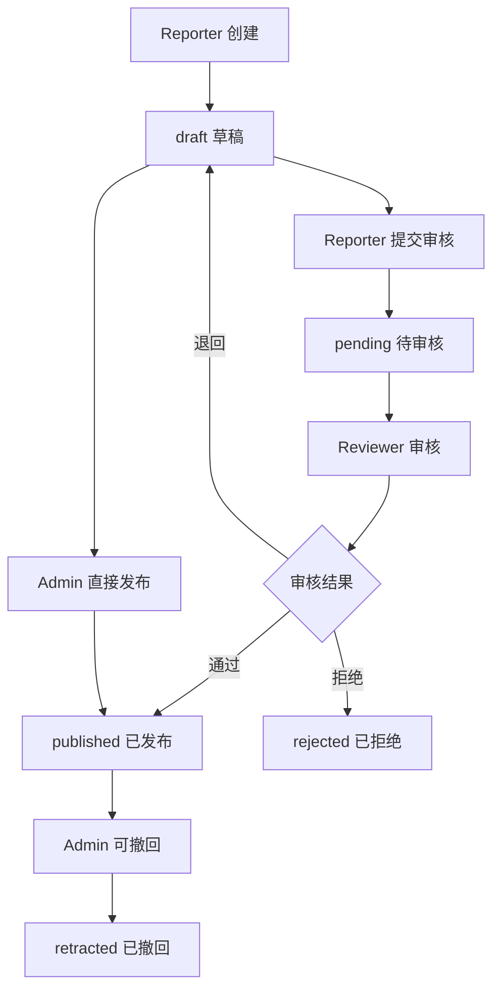

# BlacklistHub 项目设计文档

## 📋 项目概述

BlacklistHub 是一个基于 Next.js 的黑名单管理系统，提供用户举报、审核、发布和查询黑名单信息的完整工作流程。系统采用四级权限模型，确保数据的准确性和安全性。

## 🏗️ 技术架构

### 前端技术栈
- **框架**: Next.js 14 (App Router)
- **UI 组件库**: Ant Design (antd)
- **样式**: Tailwind CSS
- **状态管理**: SWR (数据获取和缓存)
- **类型检查**: TypeScript
- **HTTP 客户端**: Axios

### 后端技术栈
- **运行时**: Node.js
- **框架**: Next.js API Routes
- **数据库**: MongoDB
- **ODM**: Mongoose
- **认证**: JWT (JSON Web Tokens)
- **密码加密**: bcryptjs

### 开发工具
- **包管理器**: npm
- **代码格式化**: Prettier
- **代码检查**: ESLint
- **类型检查**: TypeScript

## 🔐 权限系统设计

### 四级权限模型

```
Reporter（举报者）
    ↓ 可以提交黑名单举报
Reviewer（审核员）  
    ↓ 可以审核举报内容
Admin（管理员）
    ↓ 可以管理普通用户，发布内容
Super Admin（超级管理员）
    ↓ 拥有所有权限，不可被删除，可管理所有角色
```

### 权限详细说明

#### 1. Reporter（举报者）
- **主要职责**: 提交黑名单举报，录入违规信息
- **权限范围**:
  - 创建新的黑名单条目（草稿状态）
  - 查看自己提交的举报记录
  - 编辑自己的草稿状态条目

#### 2. Reviewer（审核员）
- **主要职责**: 审核举报内容，验证信息真实性
- **权限范围**:
  - 查看所有待审核的举报
  - 修改举报状态（通过/拒绝/退回）
  - 查看统计数据和审核历史
  - 执行状态流转操作

#### 3. Admin（管理员）
- **主要职责**: 用户管理、内容发布、基础系统管理
- **权限范围**:
  - 管理普通用户（Reporter、Reviewer）
  - 修改普通用户角色
  - 删除普通用户
  - 直接发布草稿状态的记录
  - 修改已发布的记录
  - 导出黑名单数据
  - 访问用户管理页面

#### 4. Super Admin（超级管理员）
- **主要职责**: 系统级管理，拥有最高权限
- **核心特权**:
  - **系统级控制**: 拥有所有系统功能的最高权限
  - **不可删除**: 其他用户无法删除超级管理员账户
  - **权限管理**: 可以管理所有其他角色的权限
- **权限范围**:
  - 所有 Admin 权限
  - 管理管理员用户（删除、修改角色）
  - 修改任何用户的角色
  - 系统配置和维护

## 📊 数据模型设计

### 用户模型 (User)
```typescript
{
  _id: ObjectId,
  username: string,           // 用户名
  password_hash: string,      // 密码哈希
  role: UserRole,            // 用户角色
  createdAt: Date,           // 创建时间
  updatedAt: Date            // 更新时间
}
```

### 黑名单模型 (Blacklist)
```typescript
{
  _id: ObjectId,
  type: "user" | "ip" | "email" | "phone" | "company" | "other",  // 类型
  value: string,                                       // 失信人名称
  company_name?: string,                              // 公司名称（当type为company时必填）
  reason_code: string,                                // 理由代码
  reason: string,                                     // 详细理由
  source: string,                                     // 来源
  region: string,                                     // 地区
  risk_level: "low" | "medium" | "high",             // 风险等级
  status: "draft" | "pending" | "published" | "rejected" | "retracted", // 状态
  evidence: {                                         // 证据信息
    images: string[],                                 // 图片URL数组
    description?: string,                             // 证据描述
    uploaded_by: ObjectId,                           // 上传者
    uploaded_at: Date                                // 上传时间
  }[],
  submitter: ObjectId,                               // 提交者
  reviewer?: ObjectId,                               // 审核者
  created_at: Date,                                  // 创建时间
  updated_at: Date,                                  // 更新时间
  published_at?: Date                                // 发布时间
}
```

## 🔄 业务流程设计

### 黑名单条目生命周期



### 状态流转规则

| 当前状态 | 目标状态 | 权限要求 | 说明 |
|---------|---------|---------|------|
| draft | pending | Reporter+ | 提交审核 |
| draft | published | Admin+ | 直接发布 |
| pending | published | Reviewer+ | 审核通过 |
| pending | rejected | Reviewer+ | 审核拒绝 |
| pending | draft | Reviewer+ | 退回修改 |
| published | retracted | Admin+ | 撤回发布 |

## 🎨 前端架构设计

### 页面结构
```
/                          # 首页 - 黑名单查询
├── /users                 # 用户列表管理 (Admin+)
├── /admin/users          # 角色管理 (Admin+)
├── /admin/enums          # 枚举数据管理 (Admin+)
└── /api/*                # API 路由
```

### 组件架构
```
components/
├── NavClient.tsx          # 导航组件
├── NavWithUserInfo.tsx    # 带用户信息的导航
└── SearchCard.tsx         # 搜索卡片组件

app/
├── (public)/
│   └── home/
│       └── SearchCard.tsx # 首页搜索组件
├── users/
│   └── page.tsx          # 用户管理页面
└── admin/
    ├── users/page.tsx    # 角色管理页面
    └── enums/page.tsx    # 枚举管理页面
```

### 状态管理
- **SWR**: 用于数据获取、缓存和同步
- **React State**: 用于组件内部状态管理
- **URL State**: 用于搜索参数和分页状态

## 🔌 API 设计

### 认证相关
- `POST /api/auth/login` - 用户登录
- `POST /api/auth/register` - 用户注册
- `GET /api/userinfo` - 获取当前用户信息

### 用户管理
- `GET /api/users` - 获取用户列表 (Admin+)
- `PUT /api/users/[id]` - 更新用户角色 (Admin+)
- `DELETE /api/users/[id]` - 删除用户 (Admin+)
- `POST /api/users/batch-delete` - 批量删除用户 (Admin+)

### 黑名单管理
- `GET /api/blacklist` - 获取黑名单列表
- `POST /api/blacklist` - 创建黑名单条目
- `PUT /api/blacklist/[id]` - 更新黑名单条目
- `DELETE /api/blacklist/[id]` - 删除黑名单条目
- `GET /api/blacklist/lookup` - 公开查询接口
- `GET /api/blacklist/export` - 导出 CSV (Admin+)
- `GET /api/blacklist/export-json` - 导出 JSON (Admin+)

## 🔒 安全设计

### 认证机制
- **JWT Token**: 用于用户身份验证
- **Cookie 存储**: Token 存储在 HttpOnly Cookie 中
- **Token 验证**: 每个 API 请求都进行 Token 验证

### 权限控制
- **前端权限**: 基于用户角色显示/隐藏功能
- **后端权限**: API 级别的权限验证
- **数据权限**: 用户只能操作有权限的数据

### 数据安全
- **密码加密**: 使用 bcryptjs 进行密码哈希
- **输入验证**: 前后端双重数据验证
- **SQL 注入防护**: 使用 Mongoose ODM 防止注入攻击

## 📱 用户界面设计

### 设计原则
- **响应式设计**: 支持桌面和移动设备
- **用户友好**: 直观的操作界面和清晰的信息展示
- **权限可视化**: 根据用户权限动态显示功能

### 主要界面

#### 1. 首页搜索界面
- 黑名单查询表单
- 搜索结果列表
- 分页和筛选功能
- 风险等级指示条

#### 2. 用户管理界面
- 用户列表表格
- 角色修改下拉菜单
- 批量删除功能
- 权限控制按钮

#### 3. 角色管理界面
- 简化的角色修改界面
- 权限验证和错误处理

## 🚀 部署和运维

### 环境配置
```env
MONGODB_URI=mongodb://localhost:27017/blacklist
JWT_SECRET=your-jwt-secret-key
NODE_ENV=production
```

### 初始化脚本
- `scripts/createAdmin.ts` - 创建管理员账户
- `scripts/createSuperAdmin.ts` - 创建超级管理员账户

### 默认账户
- **超级管理员**: `superadmin` / `superadmin123456`

## 📈 扩展性设计

### 水平扩展
- 无状态 API 设计，支持负载均衡
- MongoDB 支持分片和副本集
- 前端静态资源可部署到 CDN

### 功能扩展
- 插件化的权限系统
- 可配置的工作流程
- 多租户支持
- 审计日志系统

## 🔧 开发指南

### 本地开发
```bash
# 安装依赖
npm install

# 启动开发服务器
npm run dev

# 创建超级管理员
npx tsx scripts/createSuperAdmin.ts
```

### 代码规范
- 使用 TypeScript 进行类型检查
- 遵循 ESLint 和 Prettier 规范
- 组件和函数使用 JSDoc 注释
- API 接口使用统一的错误处理

## 📋 权限系统实现细节

### 权限常量定义
```typescript
export const PERMISSIONS = {
  // 基础权限检查
  CAN_ACCESS_USER_MANAGEMENT: (role: UserRole): boolean =>
    ["admin", "super_admin"].includes(role),

  CAN_DELETE_USERS: (role: UserRole): boolean =>
    ["admin", "super_admin"].includes(role),

  CAN_CHANGE_USER_ROLES: (role: UserRole): boolean =>
    ["admin", "super_admin"].includes(role),

  // 超级管理员特权
  CAN_DELETE_SUPER_ADMINS: (_role: UserRole): boolean => false,
  CAN_DELETE_ADMINS: (role: UserRole): boolean => role === "super_admin",
  CAN_CHANGE_ADMIN_ROLES: (role: UserRole): boolean => role === "super_admin",

  // 细粒度权限控制
  CAN_DELETE_USER_BY_ROLE: (currentRole: UserRole, targetRole: UserRole): boolean => {
    if (targetRole === "super_admin") return false;
    if (targetRole === "admin") return currentRole === "super_admin";
    return ["admin", "super_admin"].includes(currentRole);
  },

  CAN_CHANGE_USER_ROLE_BY_ROLE: (currentRole: UserRole, targetRole: UserRole): boolean => {
    if (["admin", "super_admin"].includes(targetRole)) {
      return currentRole === "super_admin";
    }
    return ["admin", "super_admin"].includes(currentRole);
  },
};
```

### 角色选项配置
```typescript
export const USER_ROLE_OPTIONS = [
  { label: "Reporter", value: "reporter" },
  { label: "Reviewer", value: "reviewer" },
  { label: "Admin", value: "admin" },
  { label: "Super Admin", value: "super_admin" },
];
```

## 🎯 黑名单业务逻辑

### 理由代码分类
```typescript
const REASON_CODES = {
  // 欺诈类
  "fraud.payment": "支付欺诈",
  "fraud.chargeback": "拒付欺诈",
  "fraud.identity": "身份欺诈",
  "fraud.account": "账户欺诈",

  // 滥用类
  "abuse.spam": "垃圾信息",
  "abuse.harassment": "骚扰行为",
  "abuse.phishing": "钓鱼攻击",
  "abuse.malware": "恶意软件",

  // 违规类
  "violation.terms": "违反条款",
  "violation.policy": "违反政策",
  "violation.legal": "法律违规",

  // 安全类
  "security.breach": "安全漏洞",
  "security.suspicious": "可疑行为",

  // 质量类
  "quality.fake": "虚假信息",
  "quality.duplicate": "重复内容",

  // 其他类
  "other.manual": "人工标记",
  "other.system": "系统检测"
};
```

### 风险等级定义
- **Low**: 低风险，可能的违规行为
- **Medium**: 中等风险，确认的违规行为
- **High**: 高风险，严重违规或重复违规

### 数据合并逻辑
当相同类型和失信人名称的记录存在时：
1. 检查地区匹配性
2. 合并来源信息
3. 升级风险等级（取最高级别）
4. 更新时间线记录

## � 证据管理系统

### 证据上传功能
- **多图片上传**: 支持一次上传最多10张图片
- **文件类型限制**: 支持 JPEG、PNG、GIF、WebP 格式
- **文件大小限制**: 单个文件最大 5MB
- **安全存储**: 文件存储在服务器本地，生成唯一文件名

### 证据数据结构
```typescript
interface Evidence {
  images: string[];           // 图片URL数组
  description?: string;       // 证据描述
  uploaded_by: string;        // 上传者用户名
  uploaded_at: Date;         // 上传时间
}
```

### 证据管理API
- `POST /api/upload` - 上传图片文件
- `POST /api/blacklist/[id]/evidence` - 添加证据到黑名单条目
- `GET /api/blacklist/[id]/evidence` - 获取证据列表
- `DELETE /api/blacklist/[id]/evidence?index=0` - 删除指定证据

### 权限控制
- **添加证据**: 记录创建者、审核员、管理员可以添加证据
- **删除证据**: 证据上传者、管理员可以删除证据
- **查看证据**: 所有有权限查看记录的用户都可以查看证据

## 🏢 公司类型支持

### 公司黑名单特性
- **公司名称字段**: 当类型为 "company" 时，必须填写公司名称
- **搜索支持**: 支持按公司名称搜索
- **显示优化**: 在列表中优先显示公司名称

### 数据验证
```typescript
// 公司类型特殊验证
if (type === "company" && !company_name) {
  return NextResponse.json(
    { message: "公司类型必须提供公司名称" },
    { status: 400 }
  );
}
```

## �🔍 查询和搜索功能

### 公开查询接口
```typescript
GET /api/blacklist/lookup?type=email&value=test@example.com
GET /api/blacklist/lookup?type=company&value=company_id&company_name=公司名称
```

响应格式：
```json
{
  "hit": true,
  "risk_level": "high",
  "active_count": 2,
  "total_count": 3,
  "latest": {
    "reason_code": "fraud.payment",
    "source": "payment_system",
    "company_name": "示例公司",
    "created_at": "2024-01-01T00:00:00Z"
  }
}
```

### 高级搜索功能
- **关键词搜索**: 支持失信人名称、理由、理由代码的模糊匹配
- **多维度筛选**: 类型、风险等级、状态、来源、地区
- **时间范围**: 创建时间、更新时间筛选
- **分页支持**: 支持大数据量的分页查询

## 📊 数据导出功能

### CSV 导出格式
```csv
ID,类型,失信人名称,风险等级,理由代码,理由,来源,地区,状态,创建时间,更新时间
```

### JSON 导出格式
```json
{
  "export_time": "2024-01-01T00:00:00Z",
  "total_count": 1000,
  "data": [
    {
      "_id": "...",
      "type": "email",
      "value": "test@example.com",
      "risk_level": "high",
      "reason_code": "fraud.payment",
      "reason": "支付欺诈行为",
      "source": "payment_system",
      "region": "CN",
      "status": "published",
      "created_at": "2024-01-01T00:00:00Z",
      "updated_at": "2024-01-01T00:00:00Z"
    }
  ]
}
```

## 🛡️ 安全最佳实践

### 输入验证
- **前端验证**: 表单字段格式验证
- **后端验证**: API 参数类型和范围验证
- **数据清理**: 防止 XSS 攻击的数据清理

### 访问控制
- **路由保护**: 基于角色的路由访问控制
- **API 保护**: 每个 API 端点的权限验证
- **数据隔离**: 用户只能访问有权限的数据

### 审计日志
- **操作记录**: 记录所有重要操作的时间线
- **用户追踪**: 记录操作用户和时间
- **状态变更**: 记录状态变更的完整历史

## 🔧 开发工具和脚本

### 管理脚本
```bash
# 创建超级管理员账户
npx tsx scripts/createSuperAdmin.ts

# 初始化枚举数据
curl -X POST http://localhost:3000/api/admin/init-enum-data
```

### 开发命令
```bash
# 开发模式
npm run dev

# 构建生产版本
npm run build

# 启动生产服务器
npm start

# 代码检查
npm run lint

# 代码格式化
npm run format
```

## 📈 性能优化

### 前端优化
- **代码分割**: 使用 Next.js 自动代码分割
- **图片优化**: 使用 Next.js Image 组件
- **缓存策略**: SWR 提供智能缓存和重新验证
- **懒加载**: 组件和数据的按需加载

### 后端优化
- **数据库索引**: 为查询字段创建合适的索引
- **查询优化**: 使用 lean() 查询减少内存使用
- **分页查询**: 避免一次性加载大量数据
- **缓存机制**: 对频繁查询的数据进行缓存

### 数据库设计优化
```javascript
// 索引设计
db.blacklists.createIndex({ type: 1, value: 1 })
db.blacklists.createIndex({ status: 1, created_at: -1 })
db.blacklists.createIndex({ expires_at: 1 })
db.users.createIndex({ username: 1 }, { unique: true })
```

## 🚀 部署架构

### 生产环境架构
```
[Load Balancer]
    ↓
[Next.js App Servers] × N
    ↓
[MongoDB Cluster]
    ↓
[Backup Storage]
```

### 环境配置
- **开发环境**: 本地 MongoDB，开发模式
- **测试环境**: 云数据库，测试数据集
- **生产环境**: 高可用集群，完整监控

### 监控和日志
- **应用监控**: 性能指标和错误追踪
- **数据库监控**: 查询性能和资源使用
- **业务监控**: 用户行为和系统使用情况

---

*本文档描述了 BlacklistHub 项目的完整设计架构，包括技术选型、权限系统、数据模型、业务流程、安全设计和部署方案等核心内容。*
