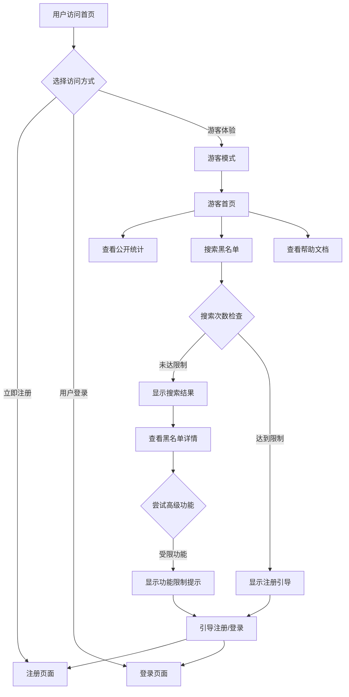

# 游客角色系统设计文档

## 📋 项目概述

### 目标
为 BlacklistHub 平台增加游客角色功能，允许未注册用户以受限的方式体验平台功能，提升用户获取率和转化率。

### 核心价值
- **降低使用门槛**：用户可以先体验再决定注册
- **提升转化率**：通过功能限制自然引导用户注册
- **增强SEO**：公开内容提高搜索引擎收录
- **品牌展示**：展示平台价值和专业性

## 🏗️ 系统架构设计

### 角色层次结构

```
权限级别：低 ────────────────────────────────────► 高
         GUEST → REPORTER → REVIEWER → ADMIN → SUPER_ADMIN
```

| 角色 | 中文名称 | 权限描述 | 典型用户 |
|------|---------|---------|---------|
| **GUEST** | 游客 | 只读访问公开信息 | 未注册用户、潜在客户 |
| **REPORTER** | 举报者 | 创建和编辑自己的黑名单 | 普通用户、信息提供者 |
| **REVIEWER** | 审核员 | 审核和发布黑名单 | 专业审核人员 |
| **ADMIN** | 管理员 | 用户管理和系统维护 | 平台管理员 |
| **SUPER_ADMIN** | 超级管理员 | 完全控制权限 | 系统管理员 |

### 游客角色特点

- ✅ **无需注册**：可以直接访问部分功能
- ✅ **只读权限**：只能查看，不能创建或修改
- ✅ **受限访问**：只能访问公开的黑名单信息
- ✅ **使用限制**：有查询次数和功能限制
- ✅ **引导注册**：通过功能限制引导用户注册

## 🔐 权限设计

### 游客权限矩阵

| 功能模块 | 访问权限 | 限制说明 | 引导行为 |
|---------|---------|---------|---------|
| **首页浏览** | ✅ 完全访问 | 展示平台介绍和公开统计 | - |
| **黑名单查看** | ✅ 受限访问 | 只能查看已发布的公开黑名单 | 详情页显示注册提示 |
| **基础搜索** | ✅ 受限访问 | 每日限制10次搜索 | 达到限制后引导注册 |
| **公开统计** | ✅ 受限访问 | 只能查看基础统计数据 | 高级统计需要注册 |
| **帮助文档** | ✅ 完全访问 | 使用指南、FAQ、API文档 | - |
| **创建黑名单** | ❌ 禁止访问 | 需要注册账户 | 显示注册引导模态框 |
| **编辑黑名单** | ❌ 禁止访问 | 需要注册账户 | 显示注册引导模态框 |
| **用户管理** | ❌ 禁止访问 | 需要管理员权限 | 显示权限不足提示 |
| **个人中心** | ❌ 禁止访问 | 需要注册账户 | 显示注册引导模态框 |
| **高级搜索** | ❌ 禁止访问 | 需要注册账户 | 显示功能升级提示 |

### 权限枚举扩展

```typescript
export enum Permission {
  // 游客专用权限
  VIEW_PUBLIC_BLACKLIST = "view_public_blacklist",
  SEARCH_PUBLIC_DATA = "search_public_data", 
  VIEW_PUBLIC_STATS = "view_public_stats",
  VIEW_HELP_DOCS = "view_help_docs",
  
  // 现有权限保持不变...
  VIEW_BLACKLIST = "view_blacklist",
  CREATE_BLACKLIST = "create_blacklist",
  // ...
}

// 游客权限配置
export const GUEST_PERMISSIONS: Permission[] = [
  Permission.VIEW_PUBLIC_BLACKLIST,
  Permission.SEARCH_PUBLIC_DATA,
  Permission.VIEW_PUBLIC_STATS,
  Permission.VIEW_HELP_DOCS,
];
```

## 🎨 用户界面设计

### 首页设计

#### 游客首页布局
```
┌─────────────────────────────────────────────────────────────┐
│                      导航栏                                  │
│  🅱️ BlacklistHub    [首页] [黑名单] [帮助]    [登录] [注册] │
├─────────────────────────────────────────────────────────────┤
│                      英雄区域                                │
│              🛡️ BlacklistHub                               │
│           安全可信的黑名单管理平台                            │
│                                                             │
│     [立即注册]  [游客模式体验]  [了解更多]                   │
├─────────────────────────────────────────────────────────────┤
│                     功能展示                                 │
│  📊 实时统计    🔍 智能搜索    🛡️ 安全防护    👥 社区贡献  │
├─────────────────────────────────────────────────────────────┤
│                   快速搜索区域                               │
│              🔍 [搜索黑名单信息...]                         │
│                 游客每日可搜索 10 次                         │
├─────────────────────────────────────────────────────────────┤
│                  最新公开黑名单                              │
│  📋 [黑名单条目1]  [黑名单条目2]  [黑名单条目3]             │
│                   [查看更多]                                │
└─────────────────────────────────────────────────────────────┘
```

### 游客导航栏设计

```tsx
// 游客专用导航栏
<header className="bg-white/90 backdrop-blur border-b">
  <div className="flex items-center justify-between px-6 h-14">
    {/* 品牌标识 */}
    <div className="flex items-center gap-2">
      <span className="w-7 h-7 bg-blue-600 rounded-lg flex items-center justify-center text-white text-xs font-bold">B</span>
      <span className="font-semibold">BlacklistHub</span>
    </div>
    
    {/* 游客导航 */}
    <nav className="hidden md:flex items-center gap-6">
      <Link href="/" className="text-gray-700 hover:text-blue-600">首页</Link>
      <Link href="/blacklist/public" className="text-gray-700 hover:text-blue-600">黑名单</Link>
      <Link href="/help" className="text-gray-700 hover:text-blue-600">帮助</Link>
    </nav>
    
    {/* 游客状态和操作 */}
    <div className="flex items-center gap-3">
      <div className="flex items-center gap-2 text-sm text-gray-600">
        <span className="w-2 h-2 bg-yellow-400 rounded-full"></span>
        <span>游客模式</span>
      </div>
      <Button size="small" type="default">登录</Button>
      <Button size="small" type="primary">注册</Button>
    </div>
  </div>
</header>
```

### 功能限制提示设计

#### 1. 内联提示
```tsx
<Alert
  type="info"
  showIcon
  message="游客模式 - 功能受限"
  description={
    <div>
      您当前以游客身份访问，今日剩余搜索次数：<strong>{remainingSearches}</strong>
      <Button type="link" size="small" className="ml-2">
        注册解锁无限制访问
      </Button>
    </div>
  }
  closable
/>
```

#### 2. 模态框引导
```tsx
<Modal
  title="解锁更多功能"
  open={showUpgradeModal}
  footer={null}
  centered
>
  <div className="text-center py-6">
    <div className="text-6xl mb-4">🚀</div>
    <h3 className="text-xl font-semibold mb-2">注册后享受更多功能</h3>
    <div className="text-gray-600 mb-6 space-y-2">
      <p>✅ 无限制搜索和查看</p>
      <p>✅ 创建和管理黑名单</p>
      <p>✅ 查看完整详细信息</p>
      <p>✅ 参与社区贡献</p>
    </div>
    <Space size="large">
      <Button type="primary" size="large" onClick={goToRegister}>
        立即注册
      </Button>
      <Button size="large" onClick={goToLogin}>
        已有账户
      </Button>
    </Space>
  </div>
</Modal>
```

## 🔧 技术实现

### 数据结构设计

#### 游客会话接口
```typescript
interface GuestSession {
  sessionId: string;           // 会话ID
  startTime: number;           // 开始时间
  lastActivity: number;        // 最后活动时间
  searchCount: number;         // 搜索次数
  viewCount: number;           // 查看次数
  ipAddress: string;           // IP地址（用于限制）
  limitations: {
    maxSearchPerDay: number;   // 每日最大搜索次数
    maxViewPerDay: number;     // 每日最大查看次数
    sessionTimeout: number;    // 会话超时时间
  };
  preferences: {
    showTips: boolean;         // 是否显示提示
    language: string;          // 语言偏好
  };
}
```

#### 游客数据过滤
```typescript
interface GuestDataFilter {
  blacklist: {
    status: "published";       // 只显示已发布
    visibility: "public";      // 只显示公开
    sensitive: false;          // 不显示敏感信息
  };
  hiddenFields: string[];      // 隐藏的字段
  maskedFields: string[];      // 脱敏的字段
}
```

### API设计

#### 游客专用API端点
```typescript
// 游客黑名单API
GET /api/guest/blacklist/public
  - 返回已发布的公开黑名单
  - 自动过滤敏感信息
  - 支持基础分页和搜索

// 游客搜索API  
GET /api/guest/search
  - 基础搜索功能
  - 有次数限制
  - 返回简化的结果

// 游客统计API
GET /api/guest/stats
  - 公开统计数据
  - 不包含敏感指标
  - 实时更新

// 游客会话API
POST /api/guest/session
  - 创建游客会话
  - 返回会话ID和限制信息

GET /api/guest/session/:sessionId
  - 获取会话状态
  - 返回使用统计和剩余限制
```

### 前端组件设计

#### 1. 游客首页组件
```typescript
// components/guest/GuestHomePage.tsx
interface GuestHomePageProps {
  publicStats: PublicStats;
  recentBlacklist: PublicBlacklistItem[];
  searchLimitations: SearchLimitations;
}
```

#### 2. 游客导航组件
```typescript
// components/guest/GuestNavigation.tsx
interface GuestNavigationProps {
  currentPath: string;
  searchRemaining: number;
  onLoginClick: () => void;
  onRegisterClick: () => void;
}
```

#### 3. 功能限制组件
```typescript
// components/guest/FeatureLimitation.tsx
interface FeatureLimitationProps {
  type: 'search' | 'view' | 'create' | 'edit';
  remaining?: number;
  onUpgrade: () => void;
}
```

#### 4. 注册引导组件
```typescript
// components/guest/RegistrationGuide.tsx
interface RegistrationGuideProps {
  trigger: 'limitation' | 'feature' | 'time';
  benefits: string[];
  onRegister: () => void;
  onLogin: () => void;
  onDismiss: () => void;
}
```

## 🎯 用户流程设计

### 游客访问流程



### 转化漏斗设计

```
游客访问 → 功能体验 → 遇到限制 → 注册引导 → 完成注册
   100%      85%       65%       45%       25%
```

**关键转化点**：
1. **首次访问**：吸引用户进入游客模式
2. **功能体验**：让用户感受到平台价值
3. **限制触发**：在合适时机显示限制
4. **注册引导**：提供清晰的升级路径

## 📊 数据访问控制

### 游客可访问的数据

#### 黑名单数据过滤
```typescript
const guestBlacklistFilter = {
  // 只显示已发布的公开黑名单
  where: {
    status: "published",
    visibility: "public",
    sensitive: false
  },
  
  // 隐藏敏感字段
  select: {
    id: true,
    type: true,
    value: true,          // 可能需要脱敏处理
    risk_level: true,
    reason_code: true,
    created_at: true,
    
    // 隐藏的字段
    operator: false,      // 隐藏操作员
    internal_notes: false, // 隐藏内部备注
    source_details: false, // 隐藏详细来源
    reviewer_notes: false  // 隐藏审核备注
  }
};
```

#### 统计数据过滤
```typescript
const guestStatsFilter = {
  // 公开统计指标
  allowed: [
    "total_blacklist_count",    // 总黑名单数量
    "published_count",          // 已发布数量
    "risk_level_distribution",  // 风险等级分布
    "type_distribution",        // 类型分布
    "monthly_growth"            // 月度增长（基础）
  ],
  
  // 隐藏的敏感指标
  hidden: [
    "user_activity",           // 用户活动数据
    "review_metrics",          // 审核指标
    "internal_performance",    // 内部性能数据
    "detailed_analytics"       // 详细分析数据
  ]
};
```

### 数据脱敏规则

```typescript
const dataMaskingRules = {
  email: {
    pattern: /^(.{2}).*@(.*)$/,
    replacement: "$1***@$2"     // example@domain.com → ex***@domain.com
  },
  phone: {
    pattern: /^(\d{3})\d{4}(\d{4})$/,
    replacement: "$1****$2"     // 13812345678 → 138****5678
  },
  ip: {
    pattern: /^(\d+\.\d+)\.\d+\.\d+$/,
    replacement: "$1.***.***"   // 192.168.1.1 → 192.168.***.***
  }
};
```

## 🔒 安全和限制机制

### 使用限制设计

#### 搜索限制
```typescript
const searchLimitations = {
  daily: {
    maxSearches: 10,           // 每日最大搜索次数
    resetTime: "00:00:00",     // 重置时间
    warningThreshold: 8        // 警告阈值
  },
  rate: {
    maxPerMinute: 5,           // 每分钟最大搜索次数
    maxPerHour: 30             // 每小时最大搜索次数
  }
};
```

#### 查看限制
```typescript
const viewLimitations = {
  daily: {
    maxViews: 50,              // 每日最大查看次数
    maxDetailViews: 20         // 每日最大详情查看次数
  },
  session: {
    maxConcurrentViews: 5,     // 同时最大查看数
    sessionTimeout: 2 * 60 * 60 * 1000 // 2小时会话超时
  }
};
```

### 安全防护机制

#### IP级别保护
```typescript
const ipProtection = {
  rateLimiting: {
    requests: 100,             // 每小时最大请求数
    searches: 20,              // 每小时最大搜索数
    views: 100                 // 每小时最大查看数
  },
  
  abuse: {
    maxFailedAttempts: 10,     // 最大失败尝试次数
    blockDuration: 60 * 60 * 1000, // 封禁时长（1小时）
    suspiciousPatterns: [       // 可疑行为模式
      "rapid_requests",
      "automated_access",
      "data_scraping"
    ]
  }
};
```

#### 数据保护
```typescript
const dataProtection = {
  anonymization: {
    noPersonalData: true,      // 不收集个人信息
    anonymousAnalytics: true,  // 匿名分析
    noTracking: true           // 不跟踪用户行为
  },
  
  privacy: {
    noCookies: true,           // 不使用跟踪Cookie
    localStorageOnly: true,    // 只使用本地存储
    dataRetention: 24 * 60 * 60 * 1000 // 数据保留24小时
  }
};
```

## 🚀 实施计划

### 阶段1：基础架构（第1-2周）

#### 1.1 枚举和类型扩展
- [ ] 扩展 UserRole 枚举添加 GUEST
- [ ] 扩展 Permission 枚举添加游客权限
- [ ] 创建 GuestSession 接口
- [ ] 更新权限映射表

#### 1.2 认证系统扩展
- [ ] 扩展 useAuth Hook 支持游客模式
- [ ] 创建游客会话管理
- [ ] 实现游客状态检测
- [ ] 更新路由保护逻辑

#### 1.3 API基础设施
- [ ] 创建游客专用API端点
- [ ] 实现数据过滤中间件
- [ ] 添加使用限制检查
- [ ] 实现IP级别的速率限制

### 阶段2：用户界面（第3-4周）

#### 2.1 游客首页
- [ ] 设计游客专用首页
- [ ] 实现功能展示区域
- [ ] 添加快速搜索功能
- [ ] 创建公开统计展示

#### 2.2 游客导航
- [ ] 创建游客专用导航栏
- [ ] 实现游客状态指示器
- [ ] 添加登录/注册快捷入口
- [ ] 优化移动端体验

#### 2.3 限制提示组件
- [ ] 创建功能限制提示组件
- [ ] 实现注册引导模态框
- [ ] 添加使用统计显示
- [ ] 设计升级引导流程

### 阶段3：功能完善（第5-6周）

#### 3.1 高级功能
- [ ] 实现游客搜索历史（本地）
- [ ] 添加收藏功能（本地）
- [ ] 创建使用教程引导
- [ ] 实现个性化推荐

#### 3.2 分析和优化
- [ ] 添加游客行为分析
- [ ] 实现A/B测试框架
- [ ] 优化转化率
- [ ] 性能监控和优化

#### 3.3 安全加固
- [ ] 实现高级防滥用机制
- [ ] 添加异常行为检测
- [ ] 完善数据保护措施
- [ ] 安全审计和测试

## 📈 成功指标

### 用户获取指标
- **游客访问量**：每日游客访问数量
- **功能使用率**：游客使用各功能的比例
- **停留时间**：游客在平台的平均停留时间
- **页面深度**：游客访问的平均页面数量

### 转化指标
- **注册转化率**：游客到注册用户的转化比例
- **功能触发率**：游客触发功能限制的比例
- **引导点击率**：注册引导的点击转化率
- **时间转化率**：不同时间段的转化效果

### 业务指标
- **用户增长率**：整体用户增长速度
- **活跃用户数**：注册后的用户活跃度
- **平台价值感知**：用户对平台价值的认知度

## 🔄 后续优化方向

### 短期优化（1-3个月）
- 根据用户反馈调整功能限制策略
- 优化注册引导的时机和方式
- 完善游客数据分析和报告
- 提升游客模式的性能表现

### 长期规划（3-12个月）
- 实现游客个性化推荐系统
- 添加社交分享功能
- 开发游客专用的移动端应用
- 探索游客付费升级模式

## 📝 开发检查清单

### 前端开发任务

#### 类型和枚举更新
- [ ] 在 `types/enums.ts` 中添加 `GUEST` 角色
- [ ] 更新 `USER_ROLE_LABELS` 添加游客标签
- [ ] 扩展 `Permission` 枚举添加游客权限
- [ ] 更新 `ROLE_PERMISSIONS` 映射表

#### 认证系统扩展
- [ ] 扩展 `useAuth` Hook 支持游客模式
- [ ] 创建 `useGuestSession` Hook
- [ ] 更新 `RouteGuard` 组件支持游客路由
- [ ] 实现跨标签页游客状态同步

#### 组件开发
- [ ] 创建 `GuestHomePage` 组件
- [ ] 创建 `GuestNavigation` 组件
- [ ] 创建 `FeatureLimitation` 组件
- [ ] 创建 `RegistrationGuide` 组件
- [ ] 创建 `GuestBlacklistView` 组件

#### 页面开发
- [ ] 重构首页支持游客模式
- [ ] 创建游客专用黑名单页面
- [ ] 创建游客帮助页面
- [ ] 更新登录/注册页面的游客入口

### 后端开发任务

#### API端点开发
- [ ] `GET /api/guest/blacklist/public` - 游客黑名单API
- [ ] `GET /api/guest/search` - 游客搜索API
- [ ] `GET /api/guest/stats` - 游客统计API
- [ ] `POST /api/guest/session` - 游客会话管理
- [ ] `GET /api/guest/limitations` - 游客限制查询

#### 数据过滤和安全
- [ ] 实现黑名单数据过滤中间件
- [ ] 添加数据脱敏处理
- [ ] 实现IP级别的速率限制
- [ ] 添加游客行为监控

#### 数据库设计
- [ ] 创建游客会话表
- [ ] 添加黑名单可见性字段
- [ ] 创建游客使用统计表
- [ ] 实现数据清理任务

### 测试任务

#### 单元测试
- [ ] 游客权限检查函数测试
- [ ] 数据过滤函数测试
- [ ] 限制检查逻辑测试
- [ ] 会话管理功能测试

#### 集成测试
- [ ] 游客访问流程测试
- [ ] 跨标签页状态同步测试
- [ ] API权限控制测试
- [ ] 数据安全性测试

#### 用户体验测试
- [ ] 游客模式可用性测试
- [ ] 注册转化流程测试
- [ ] 移动端适配测试
- [ ] 性能压力测试

## 🎯 验收标准

### 功能验收
- ✅ 游客可以无需注册访问首页
- ✅ 游客可以查看公开黑名单（有限制）
- ✅ 游客可以进行基础搜索（每日10次）
- ✅ 游客无法访问需要认证的功能
- ✅ 达到限制时显示注册引导
- ✅ 多标签页游客状态同步

### 安全验收
- ✅ 游客无法访问敏感数据
- ✅ 数据正确脱敏和过滤
- ✅ IP级别的速率限制生效
- ✅ 防止游客模式被滥用
- ✅ 游客会话安全管理

### 性能验收
- ✅ 游客页面加载时间 < 2秒
- ✅ 搜索响应时间 < 1秒
- ✅ 支持并发游客访问
- ✅ 内存和CPU使用合理

### 用户体验验收
- ✅ 游客模式入口清晰易找
- ✅ 功能限制提示友好明确
- ✅ 注册引导流程顺畅
- ✅ 移动端体验良好

---

**文档版本**：v1.0
**创建日期**：2024-08-14
**负责团队**：BlacklistHub 开发团队
**审核状态**：待审核
**预计完成时间**：6周
